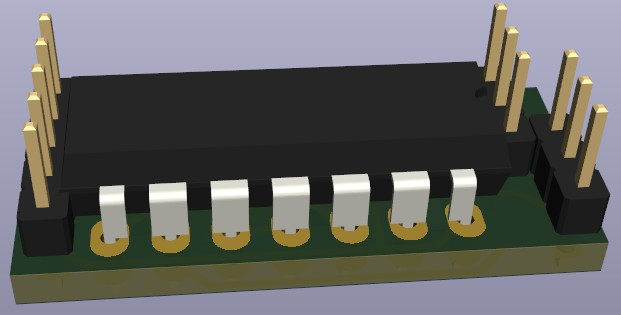

# Deboucing Logitech G305

Searching the internet you can find several reports of Logitech G305 mice
that started to do random double clicks after a while of usage.
The problem lies in the buttons that develop a bouncy contacting behaviour.
It looks something like this:

Below you can see the signal of my mouse's left button.
It sometimes bounces even longer than 1ms (like shown here).

One way to solve this is to replace the switch with a new one.
But after some time that will also start to bounce again.

From a comment by Richard Hansen under
[a stackoverflow post](https://electronics.stackexchange.com/a/29967)
I got the idea to use the single pole double throw (SPDT) nature
of the used buttons and a Set/Reset-Latch (SR-Latch)
to defeat the problem forever.
Like this:

Which is what I did.
This is the new output signal:

Fixed. Here is what I did...

## Design

I designed a small PCB that fits into the mouse's case.
On the PCB is an SR-latch and some components to pass the signals to the mouse's controller.
First I wanted to use a dedicated SR-latch,
but I had none that supported the required 2 V supply voltage.
So I made the latch from NANDs.

I used the following parts I had at hand:
- a through-hole SN74HC00N,
- SMD (SOT-23) BSS138 n-Channel MOSFETs, and
- 1206 SMD resistors.

Since the controller seems to drive the inputs (pull-up resistors)
I am using transistors to augment a have an open drain output for the SR-latch.
This "simulates" the open and closed states of the switch for the controller
instead of driving both from the SR-latch.

(I used the pin headers only for the footprint,
I soldered the wires directly to the PCB.)

Design files are in `pcb/`. Also the gerber files in `pcb/gerber.zip`.

A similar solution was proposed [on reddit](https://www.reddit.com/r/MouseReview/comments/rx35bq/mouse_debounce_detailed_explanation/?utm_source=share&utm_medium=web2x&context=3) (contains extensive background information on the topic).

## Assembly

I am using very slim cables (0.6 mm outer diameter)
because the case is very tight in some places.

To open the case you need to peel of the glider pads on the bottom:

The PCB of the switch only exposes two pins.
The third needs to be soldered separately:

Switch pinout:
- pin on the side of the button: GND
- middle pin: pressed
- pin away from the button: unpressed

It is helpful to pull the cables from the left switch
through the end of the battery compartment (see below).
This way they will not be in the way of the LED or the DPI switch.

I found a supply voltage of 2 V at `TP11`
that is available as long as the mouse is switched on.

(I used smaller cables in the end,
because this area in the casing is very tight.
Careful not to melt the case with the soldering iron.)

I used 15 kOhm resistors that is approximately equal to the controller internal pull-ups (I measured 142 uA at 2 V).

(Note: I switched the cables on the right to slimmer ones as well.)

(The wires could be shorter. Would probably make the assembly a bit easier.)

I sealed the board in a shrink tube.
When assembling, the latch board is on the right side of the mouse.
The cables can easily be caught under the mounting posts or on the switches,
so assembling takes some time.

## Notes

- If you want to replicate this and have any questions,
  just write an issue.
- Since I use pull-up resistors also for the unpressed button state,
  the battery will probably drain faster.
  I will get back to this if it will become an issue.
